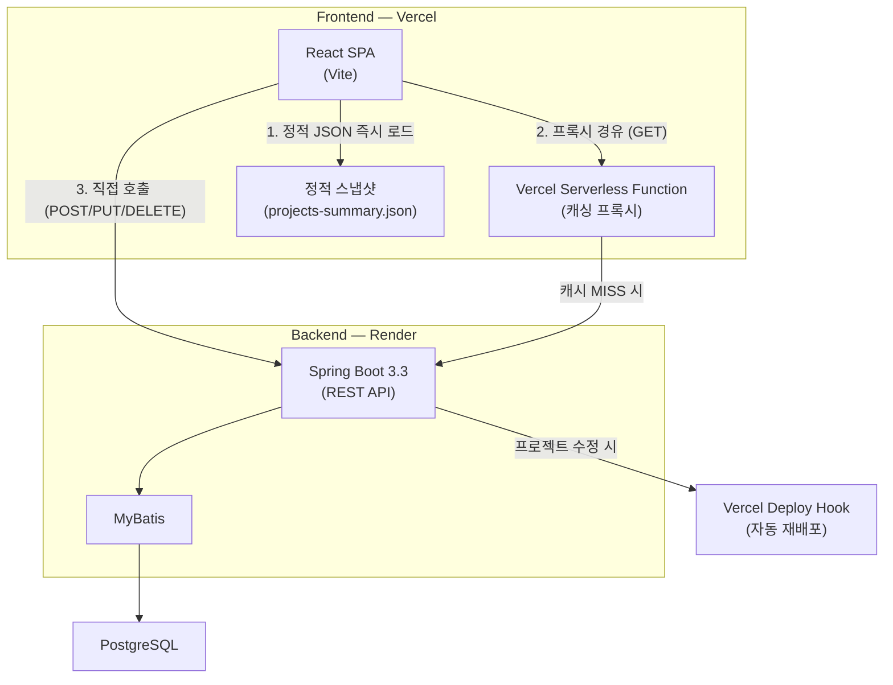

# My Portfolio

개인 포트폴리오 웹 애플리케이션입니다. 프로젝트 이력을 Case Study 형식의 상세 페이지로 구성하여, 구현 과정·문제 해결·성과를 한눈에 확인할 수 있도록 정리했습니다.

## 목차

- [아키텍처](#아키텍처)
- [기술 스택](#기술-스택)
- [프로젝트 구조](#프로젝트-구조)
- [주요 기능](#주요-기능)
- [성능 최적화](#성능-최적화)
- [API 명세](#api-명세)
- [데이터베이스 스키마](#데이터베이스-스키마)
- [배포 환경](#배포-환경)
- [로컬 개발 환경](#로컬-개발-환경)
- [환경 변수](#환경-변수)

---

## 아키텍처



### 데이터 흐름

**메인 페이지 (포트폴리오 목록)**

1. `projects-summary.json` 정적 파일을 Vercel CDN에서 즉시 로드 → 카드 렌더링
2. Vercel Serverless Function 프록시를 통해 최신 데이터 백그라운드 갱신
3. 프록시 응답은 `s-maxage=300, stale-while-revalidate=3600`으로 CDN 캐싱

**상세 페이지**

1. Vercel Serverless Function 프록시 경유 → CDN 캐시 반환 또는 Render 호출

**관리자 페이지**

1. Render 백엔드 직접 호출 (CRUD 작업)
2. 프로젝트 수정/생성 시 Vercel Deploy Hook으로 프론트엔드 자동 재배포

---

## 기술 스택

### Frontend

| 기술 | 버전 | 용도 |
|------|------|------|
| React | 19.x | UI 라이브러리 |
| Vite | 8.x | 빌드 도구 및 개발 서버 |
| React Router | 7.x | 클라이언트 사이드 라우팅 |
| Vanilla CSS | - | 스타일링 (프레임워크 미사용) |
| Vercel Serverless Functions | - | 캐싱 프록시 |

### Backend

| 기술 | 버전 | 용도 |
|------|------|------|
| Java | 17 | 런타임 |
| Spring Boot | 3.3.5 | 웹 프레임워크 |
| MyBatis | 3.0.4 | SQL 매퍼 |
| PostgreSQL | - | 데이터베이스 |
| Lombok | - | 보일러플레이트 코드 제거 |

### 인프라

| 서비스 | 용도 |
|--------|------|
| Vercel | 프론트엔드 호스팅 + Serverless Functions + CDN |
| Render | 백엔드 호스팅 (Docker) |
| PostgreSQL (Render) | 데이터베이스 |

---

## 프로젝트 구조

```
my-portfolio/
├── frontend/                         # React SPA (Vite)
│   ├── api/                          # Vercel Serverless Functions
│   │   └── projects/
│   │       ├── summary.js            #   GET /api/projects/summary 프록시
│   │       ├── [id].js               #   GET /api/projects/:id 프록시
│   │       └── [id]/
│   │           └── thumbnail.js      #   GET /api/projects/:id/thumbnail 프록시
│   ├── scripts/
│   │   └── export-project-snapshot.mjs  # 빌드 시 정적 스냅샷 생성 스크립트
│   ├── public/
│   │   ├── projects-summary.json     # 정적 프로젝트 목록 (빌드 시 생성)
│   │   └── project-thumbnails/       # 정적 썸네일 이미지 (빌드 시 생성)
│   ├── src/
│   │   ├── api/
│   │   │   └── projectApi.js         # API 클라이언트 (프록시/직접 분기)
│   │   ├── components/
│   │   │   └── ProjectFormModal.jsx  # 프로젝트 생성/수정 모달
│   │   ├── pages/
│   │   │   ├── PortfolioPage.jsx     # 메인 포트폴리오 목록
│   │   │   ├── ProjectDetailPage.jsx # 프로젝트 상세 (Case Study)
│   │   │   └── AdminPage.jsx         # 관리자 대시보드
│   │   ├── App.jsx                   # 라우팅 설정
│   │   ├── App.css                   # 전체 스타일시트
│   │   └── index.css                 # 기본 리셋 및 폰트 설정
│   ├── vercel.json                   # Vercel 라우팅 설정
│   └── package.json
│
└── backend/                          # Spring Boot API 서버
    ├── src/main/java/com/portfolio/
    │   ├── config/
    │   │   └── WebConfig.java        # CORS 설정
    │   ├── common/
    │   │   ├── ApiResponse.java      # 공통 응답 래퍼 (record)
    │   │   ├── RootController.java   # 루트 경로 핸들러
    │   │   └── exception/
    │   │       └── GlobalExceptionHandler.java  # 전역 예외 처리
    │   ├── project/
    │   │   ├── controller/
    │   │   │   └── ProjectController.java  # 프로젝트 CRUD + 썸네일 API
    │   │   ├── domain/
    │   │   │   └── Project.java            # 도메인 엔티티 (검증 로직 포함)
    │   │   ├── dto/
    │   │   │   ├── ProjectCreateRequest.java
    │   │   │   ├── ProjectUpdateRequest.java
    │   │   │   ├── ProjectOrderUpdateRequest.java
    │   │   │   └── ProjectResponse.java    # from() / fromSummary() 팩토리
    │   │   ├── mapper/
    │   │   │   └── ProjectMapper.java      # MyBatis 인터페이스
    │   │   └── service/
    │   │       ├── ProjectService.java
    │   │       └── ProjectServiceImpl.java
    │   ├── visit/
    │   │   ├── controller/
    │   │   │   └── VisitController.java    # 방문 로깅 API
    │   │   ├── domain/ / dto/ / mapper/ / service/
    │   │   └── ...
    │   └── deploy/
    │       └── service/
    │           ├── DeployHookService.java           # 인터페이스
    │           └── VercelDeployHookService.java      # Vercel Deploy Hook 트리거
    ├── src/main/resources/
    │   ├── application.yml           # 애플리케이션 설정
    │   ├── schema.sql                # DDL (자동 실행)
    │   └── mapper/
    │       └── ProjectMapper.xml     # MyBatis SQL 매퍼
    ├── Dockerfile                    # 멀티 스테이지 빌드
    └── build.gradle
```

---

## 주요 기능

### 포트폴리오 메인 페이지

- 프로젝트 카드 그리드 레이아웃 (데스크톱 2열 → 모바일 1열)
- 정적 스냅샷 우선 로드 + API 백그라운드 갱신 (Stale-While-Refresh 패턴)
- 스크롤 기반 등장 애니메이션 (`pdReveal`)
- 이미지 lazy loading + async decoding

### 프로젝트 상세 페이지 (Case Study)

- 히어로 섹션 (썸네일 + 프로젝트 메타 정보)
- 번호 매겨진 콘텐츠 섹션 (기술 스택, 설명, 담당 역할, 트러블슈팅, 성과)
- 기능 화면 갤러리 (최대 5장, 캡션 지원)
- Intersection Observer 기반 스크롤 애니메이션
- GitHub / 프로젝트 / 배포 링크 연동

### 관리자 대시보드

- 프로젝트 CRUD (생성, 수정, 삭제)
- 프로젝트 표시 순서 변경
- 프로젝트 공개/비공개 토글 (`useYn`)
- 썸네일 이미지 업로드 (Base64 Data URL 변환)
- 기능 화면 이미지 URL 관리 (최대 5장 + 캡션)
- 방문 로그 조회 (IP, User-Agent, 레퍼러 추적)
- `?ref=admin` 파라미터로 관리자 방문 로그 제외

### 방문 추적

- 페이지 방문 시 자동 로깅 (URL, 레퍼러, IP, User-Agent)
- 관리자 세션 (`?ref=admin`) 방문 제외
- IP 기반 방문 그룹핑

---

## 성능 최적화

### 3겹 캐싱 아키텍처

```
[1층] 빌드 타임 정적 스냅샷
        ↓ prebuild 스크립트가 Render API에서 데이터를 가져와
        ↓ projects-summary.json + 썸네일 이미지를 정적 파일로 생성
        ↓ Vercel CDN에서 즉시 반환 (~50ms)

[2층] Vercel Serverless Function 캐싱 프록시
        ↓ s-maxage=300 (CDN 5분 캐시)
        ↓ stale-while-revalidate=3600 (만료 후 1시간까지 stale 반환)
        ↓ 사용자는 Render Cold Start를 직접 경험하지 않음

[3층] 프론트엔드 우선 로드 전략
        ↓ 정적 스냅샷 먼저 렌더링 → API로 백그라운드 갱신
        ↓ 로딩 스피너 대신 즉시 카드 표시
```

### 모바일 최적화

- 3단계 반응형 브레이크포인트 (1040px / 760px / 480px)
- 터치 영역 최소 44px (Apple HIG 준수)
- 카드 오버레이 모바일에서 항상 표시
- `clamp()` 기반 반응형 타이포그래피
- 이미지 `loading="lazy"` + `decoding="async"`
- Inter 웹 폰트 (Google Fonts, `display=swap`)

### Vercel Deploy Hook 자동 재배포

- 관리자가 프로젝트를 수정하면 백엔드에서 Vercel Deploy Hook을 비동기 호출
- Vercel 재배포 시 `prebuild` 스크립트가 실행되어 정적 스냅샷 갱신
- 사용자는 항상 최신 데이터를 정적 파일로 받음

---

## API 명세

### 프로젝트

| Method | Endpoint | 설명 | 캐싱 |
|--------|----------|------|------|
| `GET` | `/api/projects` | 전체 목록 (관리자용) | - |
| `GET` | `/api/projects/summary` | 요약 목록 (포트폴리오용) | Vercel 프록시 |
| `GET` | `/api/projects/:id` | 프로젝트 상세 | Vercel 프록시 |
| `GET` | `/api/projects/:id/thumbnail` | 썸네일 이미지 (Base64 → 바이너리) | Vercel 프록시 |
| `POST` | `/api/projects` | 프로젝트 생성 | - |
| `PUT` | `/api/projects/:id` | 프로젝트 수정 | - |
| `PUT` | `/api/projects/order` | 표시 순서 변경 | - |
| `DELETE` | `/api/projects/:id` | 프로젝트 삭제 | - |

### 방문 로그

| Method | Endpoint | 설명 |
|--------|----------|------|
| `POST` | `/api/visits` | 방문 로그 저장 |
| `GET` | `/api/visits` | 방문 로그 조회 |

### 기타

| Method | Endpoint | 설명 |
|--------|----------|------|
| `GET` | `/api/health` | 서버 상태 확인 |

### 응답 형식

모든 API는 `ApiResponse<T>` 래퍼로 통일된 응답을 반환합니다.

```json
{
  "success": true,
  "data": { ... },
  "message": "프로젝트 목록 조회에 성공했습니다."
}
```

---

# 데이터베이스 스키마

## 테이블 목록

| 테이블명 | 설명 |
|----------|------|
| `projects` | 포트폴리오 프로젝트 |
| `project_attachments` | 프로젝트 첨부파일 |
| `project_troubles` | 프로젝트 트러블슈팅 항목 |
| `project_trouble_solutions` | 트러블슈팅 해결 방안 |
| `visits` | 방문자 로그 |
| `chat_logs` | AI 챗봇 대화 로그 |

---

## projects

포트폴리오 프로젝트 기본 정보를 저장합니다.

| 컬럼 | 타입 | 설명 |
|------|------|------|
| `id` | `BIGINT` (PK, Auto) | 프로젝트 ID |
| `title` | `VARCHAR(255) NOT NULL` | 프로젝트 제목 |
| `summary` | `VARCHAR(500)` | 요약 설명 |
| `description` | `TEXT` | 상세 설명 |
| `thumbnail_url` | `TEXT` | 썸네일 이미지 (URL 또는 Base64 Data URL) |
| `feature_image_urls` | `TEXT` | 기능 화면 이미지 URL (줄바꿈 구분, 최대 5개) |
| `feature_image_captions` | `TEXT` | 기능 화면 캡션 (줄바꿈 구분) |
| `project_url` | `VARCHAR(500)` | 프로젝트 링크 |
| `start_date` | `DATE` | 시작일 |
| `end_date` | `DATE` | 종료일 (`NULL` = 진행 중) |
| `use_yn` | `CHAR(1) DEFAULT 'Y'` | 공개 여부 |
| `tech_stack` | `TEXT` | 기술 스택 (쉼표 구분) |
| `my_role` | `TEXT` | 담당 역할 (줄바꿈 구분) |
| `trouble_shooting` | `TEXT` | 트러블슈팅 내용 (줄바꿈 구분) |
| `github_url` | `VARCHAR(500)` | GitHub 링크 |
| `deploy_url` | `VARCHAR(500)` | 배포 링크 |
| `result` | `TEXT` | 성과 및 결과 (줄바꿈 구분) |
| `display_order` | `INTEGER DEFAULT 0` | 표시 순서 |
| `created_at` | `TIMESTAMP` | 생성일시 |
| `updated_at` | `TIMESTAMP` | 수정일시 |

---

## project_attachments

프로젝트에 첨부된 파일(바이너리)을 저장합니다. 프로젝트당 1개 제한 (`project_id` UNIQUE).

| 컬럼 | 타입 | 설명 |
|------|------|------|
| `id` | `BIGINT` (PK, Auto) | 첨부파일 ID |
| `project_id` | `BIGINT NOT NULL` (FK → `projects.id`, UNIQUE) | 프로젝트 ID |
| `filename` | `VARCHAR(255) NOT NULL` | 파일명 |
| `content_type` | `VARCHAR(255) NOT NULL` | MIME 타입 |
| `file_size` | `BIGINT NOT NULL` | 파일 크기 (bytes) |
| `data` | `BYTEA NOT NULL` | 파일 바이너리 데이터 |
| `created_at` | `TIMESTAMP` | 생성일시 |
| `updated_at` | `TIMESTAMP` | 수정일시 |

> `project_id`에 UNIQUE 제약이 있어 프로젝트당 하나의 첨부파일만 허용됩니다.  
> 프로젝트 삭제 시 CASCADE 삭제됩니다.

---

## project_troubles

프로젝트별 트러블슈팅 항목을 저장합니다.

| 컬럼 | 타입 | 설명 |
|------|------|------|
| `id` | `BIGINT` (PK, Auto) | 트러블 ID |
| `project_id` | `BIGINT NOT NULL` (FK → `projects.id`) | 프로젝트 ID |
| `title` | `VARCHAR(255)` | 트러블 제목 |
| `problem` | `TEXT` | 문제 상황 설명 |
| `selected_solution_id` | `BIGINT` (FK → `project_trouble_solutions.id`) | 채택된 해결 방안 ID |
| `selected_reason` | `TEXT` | 채택 이유 |
| `sort_order` | `INTEGER DEFAULT 0 NOT NULL` | 표시 순서 |
| `created_at` | `TIMESTAMP` | 생성일시 |
| `updated_at` | `TIMESTAMP` | 수정일시 |

**인덱스**
- `idx_project_troubles_project_id` on `(project_id, sort_order, id)`

> 프로젝트 삭제 시 CASCADE 삭제됩니다.  
> `selected_solution_id` 참조 대상 삭제 시 `NULL`로 설정됩니다.

---

## project_trouble_solutions

트러블슈팅 항목의 해결 방안 후보들을 저장합니다.

| 컬럼 | 타입 | 설명 |
|------|------|------|
| `id` | `BIGINT` (PK, Auto) | 해결 방안 ID |
| `trouble_id` | `BIGINT NOT NULL` (FK → `project_troubles.id`) | 트러블 ID |
| `title` | `VARCHAR(255)` | 해결 방안 제목 |
| `pros` | `TEXT` | 장점 |
| `cons` | `TEXT` | 단점 |
| `sort_order` | `INTEGER DEFAULT 0 NOT NULL` | 표시 순서 |
| `created_at` | `TIMESTAMP` | 생성일시 |
| `updated_at` | `TIMESTAMP` | 수정일시 |

**인덱스**
- `idx_project_trouble_solutions_trouble_id` on `(trouble_id, sort_order, id)`

> 트러블 삭제 시 CASCADE 삭제됩니다.

---

## visits

페이지 방문자 로그를 저장합니다.

| 컬럼 | 타입 | 설명 |
|------|------|------|
| `id` | `BIGINT` (PK, Auto) | 방문 ID |
| `page_url` | `VARCHAR(1000)` | 방문 페이지 URL |
| `referrer` | `VARCHAR(1000)` | 유입 경로 |
| `ref_param` | `VARCHAR(255)` | ref 쿼리 파라미터 |
| `ip_address` | `VARCHAR(100)` | 방문자 IP |
| `user_agent` | `TEXT` | 브라우저 User-Agent |
| `visited_at` | `TIMESTAMP` | 방문 일시 |

---

## chat_logs

AI 챗봇 대화 내역 및 오류를 저장합니다.

| 컬럼 | 타입 | 설명 |
|------|------|------|
| `id` | `BIGINT` (PK, Auto) | 로그 ID |
| `question` | `TEXT NOT NULL` | 사용자 질문 |
| `answer` | `TEXT` | AI 응답 |
| `success_yn` | `CHAR(1) DEFAULT 'Y' NOT NULL` | 응답 성공 여부 |
| `error_message` | `TEXT` | 오류 메시지 (실패 시) |
| `created_at` | `TIMESTAMP` | 생성일시 |

---

## ERD (관계 요약)

```
projects (1) ──── (0..1) project_attachments
projects (1) ──── (0..N) project_troubles
project_troubles (1) ──── (0..N) project_trouble_solutions
project_troubles.selected_solution_id ──── (0..1) project_trouble_solutions
```

---

## 배포 환경

### Frontend → Vercel

- **프레임워크**: Vite
- **빌드 명령어**: `npm run build` (자동으로 `prebuild` 스크립트 실행)
- **출력 디렉토리**: `dist`
- **Serverless Functions**: `api/` 디렉토리
- **라우팅**: `vercel.json`에서 SPA fallback 설정

### Backend → Render

- **서비스 타입**: Web Service (Docker)
- **Dockerfile**: 멀티 스테이지 빌드 (JDK 17 빌드 → JRE 17 실행)
- **포트**: 8080
- **데이터베이스**: Render PostgreSQL

---

## 로컬 개발 환경

### 요구사항

- Node.js 18+
- Java 17
- PostgreSQL

### Frontend 실행

```bash
cd frontend
npm install
npm run dev        # http://localhost:5173
```

### Backend 실행

```bash
cd backend
./gradlew bootRun  # http://localhost:8080
```

### 정적 스냅샷 수동 생성

```bash
cd frontend
npm run snapshot   # public/projects-summary.json 생성
```

---

## 환경 변수

### Frontend

| 변수 | 설명 | 예시 |
|------|------|------|
| `VITE_API_URL` | 백엔드 API URL | `https://my-portfolio-yol2.onrender.com` |
| `RENDER_API_URL` | 빌드/프록시에서 사용하는 백엔드 URL (선택) | `VITE_API_URL` 대체 가능 |

### Backend

| 변수 | 설명 | 예시 |
|------|------|------|
| `SPRING_DATASOURCE_URL` | PostgreSQL 접속 URL | `jdbc:postgresql://host:5432/dbname` |
| `SPRING_DATASOURCE_USERNAME` | DB 사용자명 | `portfolio_user` |
| `SPRING_DATASOURCE_PASSWORD` | DB 비밀번호 | `********` |
| `SPRING_SQL_INIT_MODE` | `schema.sql` 자동 실행 여부. 운영 배포는 기본 `never`, 최초 DB 생성/수동 마이그레이션 때만 `always` 사용 | `never` |
| `PORT` | 서버 포트 (기본 8080) | `8080` |
| `vercel.deploy-hook-url` | Vercel Deploy Hook URL (선택) | `https://api.vercel.com/v1/...` |

### Vercel 환경변수 (Serverless Function용)

| 변수 | 설명 | 예시 |
|------|------|------|
| `BACKEND_API_URL` | Render 백엔드 URL | `https://my-portfolio-yol2.onrender.com` |
